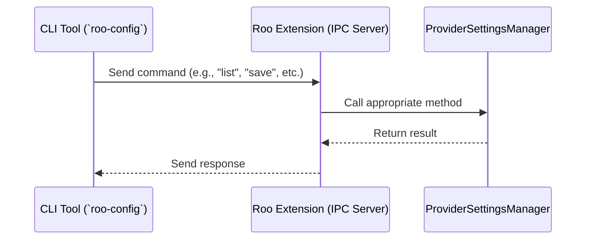

<div align="center">
<sub>

English • [Català](locales/ca/README.md) • [Deutsch](locales/de/README.md) • [Español](locales/es/README.md) • [Français](locales/fr/README.md) • [हिन्दी](locales/hi/README.md) • [Italiano](locales/it/README.md)

</sub>
<sub>

[日本語](locales/ja/README.md) • [한국어](locales/ko/README.md) • [Polski](locales/pl/README.md) • [Português (BR)](locales/pt-BR/README.md) • [Türkçe](locales/tr/README.md) • [Tiếng Việt](locales/vi/README.md) • [简体中文](locales/zh-CN/README.md) • [繁體中文](locales/zh-TW/README.md)

</sub>
</div>
<br>
<div align="center">
  <h1>Roo Code With CLI</h1>
  <h3>A fork of Roo Code with CLI control capabilities</h3>
  
  <a href="https://marketplace.visualstudio.com/items?itemName=RooVeterinaryInc.roo-cline-with-cli" target="_blank"></a>
  <a href="https://github.com/RooVetGit/Roo-Code" target="_blank"></a>
  <a href="https://docs.roocode.com" target="_blank"></a>
  
</div>

# Roo Code With CLI

This repository is a fork of [Roo Code With CLI](https://github.com/RooVetGit/Roo-Code) that adds a powerful CLI interface to control and configure the Roo Code With CLI VS Code extension programmatically. This enables automation, scripting, and remote management of Roo Code With CLI configurations.

## What's New in This Fork

This fork implements the **Roo Configuration Bridge**, which allows you to:

- Manage provider configurations via command line
- Save, load, list, and delete configuration profiles
- Assign configurations to specific Roo modes
- Automate Roo Code With CLI setup in CI/CD pipelines or team environments
- Script configuration changes for different projects or tasks

## Architecture

The bridge uses inter-process communication (IPC) sockets to establish a secure connection between the CLI tool and the VS Code extension:



## Setup

### VS Code Extension

1. Enable the bridge in VS Code settings:

    ```json
    "roo.bridge.enabled": true
    ```

2. Restart VS Code or reload the window to apply the settings.

### CLI Tool

1. Install the CLI tool:

    ```bash
    cd roo-cli
    npm install
    npm run build
    npm link
    ```

2. Verify the installation:
    ```bash
    roo-config --help
    ```

## Usage

### List Configurations

```bash
roo-config list
```

Example output:

```
Available configuration profiles:
- default (ID: default-id, Provider: openai)
- gpt4 (ID: gpt4-1234567890, Provider: openai)
- claude (ID: claude-1234567890, Provider: anthropic)
```

### Save Configuration

```bash
roo-config save <profile-name> --provider <provider-name> --apiKey <api-key>
```

Example:

```bash
roo-config save my-openai --provider openai --apiKey "sk-..."
```

You can also save a configuration from a JSON file:

```bash
roo-config save my-config --from-file config.json
```

### Load Configuration

```bash
roo-config load <profile-name>
```

### Delete Configuration

```bash
roo-config delete <profile-name>
```

### Assign Configuration to Mode

```bash
roo-config assign-mode <mode-slug> <profile-name>
```

Example:

```bash
roo-config assign-mode code my-openai
```

### Get Configuration for Mode

```bash
roo-config get-mode <mode-slug>
```

## Security

- The bridge is disabled by default (`roo.bridge.enabled: false`).
- IPC socket is only accessible from the local machine.
- Socket is created in a secure temporary directory.

## Documentation

For more detailed documentation, see:

- [Roo Configuration Bridge Documentation](docs/roo-config-bridge.md)
- [CLI Bridge Plan](docs/cli-bridge-plan.md)

## Original Roo Code With CLI Features

This fork maintains all the original features of Roo Code With CLI:

- 🚀 **Generate Code** from natural language descriptions
- 🔧 **Refactor & Debug** existing code
- 📝 **Write & Update** documentation
- 🤔 **Answer Questions** about your codebase
- 🔄 **Automate** repetitive tasks
- 🏗️ **Create** new files and projects

## Local Setup & Development

1. **Clone** the repo:

```sh
git clone https://github.com/yourusername/Roo-Code-CLI-Bridge.git
```

2. **Install dependencies**:

```sh
npm run install:all
```

3. **Start the webview (Vite/React app with HMR)**:

```sh
npm run dev
```

4. **Debug**:
   Press `F5` (or **Run** → **Start Debugging**) in VSCode to open a new session with Roo Code With CLI loaded.

## Contributing

Contributions are welcome! Please feel free to submit a Pull Request.

## Disclaimer

This is an unofficial fork of Roo Code With CLI. All original disclaimers from Roo Code With CLI apply:

**Please note** that Roo Code With CLI, Inc does **not** make any representations or warranties regarding any code, models, or other tools provided or made available in connection with Roo Code With CLI, any associated third-party tools, or any resulting outputs. You assume **all risks** associated with the use of any such tools or outputs; such tools are provided on an **"AS IS"** and **"AS AVAILABLE"** basis.

## License

[Apache 2.0 © 2025 Roo Code With CLI, Inc.](./LICENSE)

---

**Note:** This fork is maintained independently from the original Roo Code With CLI project. For the official version, please visit [the original Roo Code With CLI repository](https://github.com/RooVetGit/Roo-Code).
