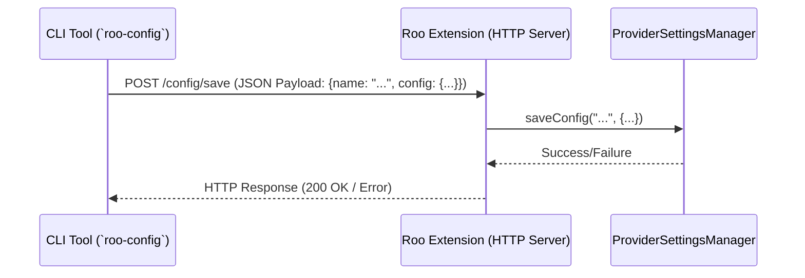

# Plan: Roo Configuration Bridge

**1. Goal:**

To create a mechanism allowing a command-line interface (CLI) tool (`roo-config`) to securely communicate with the Roo VS Code extension to manage provider configurations programmatically.

**2. Architecture Overview:**

A local HTTP server within the Roo VS Code extension will listen for requests from the `roo-config` CLI tool. The CLI translates user commands into HTTP requests.

**3. Component Breakdown:**

**A. Roo VS Code Extension Modifications:**

- **Settings:**
    - `roo.bridge.enabled: boolean` (default: `false`) - Controls if the server starts.
    - `roo.bridge.port: number` (default: `30001`) - Port for the server.
    - `roo.bridge.secret: string` (optional) - Secret token for authentication. Recommended to store via `vscode.secrets`.
- **HTTP Server:**
    - Uses Node.js `http` module.
    - Starts only if `roo.bridge.enabled` is `true`.
    - Binds _only_ to `localhost` (`127.0.0.1`).
    - Listens on `roo.bridge.port`.
- **API Endpoints:**
    - `POST /config/save`: Saves/updates a profile. Body: `{ "name": "...", "config": { ... } }`.
    - `POST /config/load`: Loads/activates a profile. Body: `{ "name": "..." }`.
    - `GET /config/list`: Returns list of profile names and details.
    - `POST /config/delete`: Deletes a profile. Body: `{ "name": "..." }`.
    - `POST /config/setMode`: Assigns config to a mode. Body: `{ "mode": "...", "configId": "..." }`.
    - `GET /config/getMode`: Gets config ID for a mode. Query: `?mode=...`.
- **Integration:** Endpoint handlers use the existing `ProviderSettingsManager`.
- **Authentication:** If `roo.bridge.secret` is set (via settings or `vscode.secrets`), the server expects the token in an `X-Roo-Bridge-Secret` header. Rejects with `401 Unauthorized` if missing or incorrect.
- **Error Handling:** Standard HTTP status codes (400, 401, 404, 500) and JSON error messages.

**B. New CLI Tool (`roo-config`):**

- **Project Setup:** Separate Node.js project using `commander` or `yargs`.
- **Commands:** Mirroring API endpoints:
    - `roo-config save <profile-name> [--provider <name>] [--apiKey <key>] ... | --from-file <path> | --json '<json_string>'`
    - `roo-config load <profile-name>`
    - `roo-config list`
    - `roo-config delete <profile-name>`
    - `roo-config assign-mode <mode-slug> <profile-id-or-name>`
    - `roo-config get-mode <mode-slug>`
- **Configuration:** Reads server port and secret token via:
    - Environment variables (e.g., `ROO_BRIDGE_PORT`, `ROO_BRIDGE_SECRET`).
    - Command-line flags (e.g., `--port <num>`, `--secret <token>`).
    - A configuration file (e.g., `~/.config/roo/cli.json`).
- **HTTP Client:** Uses `axios` or `fetch` to call `http://localhost:<port>/<endpoint>`. Sends `X-Roo-Bridge-Secret` header if configured. Sets `Content-Type: application/json`.
- **Output:** Clear success/error messages.

**4. Security:**

- **Opt-in:** Bridge is disabled by default (`roo.bridge.enabled: false`).
- **Localhost Binding:** Server _only_ accessible from the local machine.
- **Authentication:** Shared secret token is recommended.
    - The CLI tool _cannot_ access secrets stored via `vscode.secrets`.
    - The user must provide the secret token separately to the CLI tool (via env var, flag, or config file).
- **Input Validation:** Both server and CLI should validate inputs.

**5. Setup and Usage:**

- **Extension:** User enables bridge in VS Code settings, configures port/secret (optionally storing secret via `vscode.secrets`), reloads VS Code.
- **CLI:** User installs `roo-config`, configures port/secret for the CLI, runs commands.
