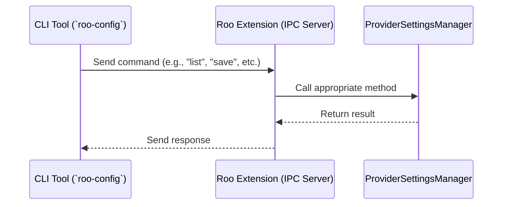

# Roo Configuration Bridge

The Roo Configuration Bridge allows CLI tools to communicate with the Roo VS Code extension to manage provider configurations programmatically. This document explains how to set up and use the bridge.

## Architecture

The bridge uses inter-process communication (IPC) sockets to establish a secure connection between the CLI tool and the VS Code extension:



## Setup

### VS Code Extension

1. Enable the bridge in VS Code settings:

    ```json
    "roo.bridge.enabled": true
    ```

2. Restart VS Code or reload the window to apply the settings.

### CLI Tool

1. Install the CLI tool:

    ```bash
    cd roo-cli
    npm install
    npm run build
    npm link
    ```

2. Verify the installation:
    ```bash
    roo-config --help
    ```

## Usage

### List Configurations

```bash
roo-config list
```

Example output:

```
Available configuration profiles:
- default (ID: default-id, Provider: openai)
- gpt4 (ID: gpt4-1234567890, Provider: openai)
- claude (ID: claude-1234567890, Provider: anthropic)
```

### Save Configuration

```bash
roo-config save <profile-name> --provider <provider-name> --apiKey <api-key>
```

Example:

```bash
roo-config save my-openai --provider openai --apiKey "sk-..."
```

You can also save a configuration from a JSON file:

```bash
roo-config save my-config --from-file config.json
```

Or directly from a JSON string:

```bash
roo-config save my-config --json '{"apiProvider":"openai","apiKey":"sk-..."}'
```

### Load Configuration

```bash
roo-config load <profile-name>
```

Example:

```bash
roo-config load my-openai
```

### Delete Configuration

```bash
roo-config delete <profile-name>
```

Example:

```bash
roo-config delete my-openai
```

### Assign Configuration to Mode

```bash
roo-config assign-mode <mode-slug> <profile-name>
```

Example:

```bash
roo-config assign-mode code my-openai
```

### Get Configuration for Mode

```bash
roo-config get-mode <mode-slug>
```

Example:

```bash
roo-config get-mode code
```

## Configuration

The CLI tool can be configured using:

1. Environment variables:

    - `ROO_BRIDGE_SECRET`: Secret token for authentication

2. Command-line flags:

    - `--secret <token>`: Secret token for authentication
    - `--save-config`: Save settings to config file

3. Configuration file:
    - Location: `~/.config/roo/cli.json`
    - Format: JSON object with settings

## Security

- The bridge is disabled by default (`roo.bridge.enabled: false`).
- IPC socket is only accessible from the local machine.
- Socket is created in a secure temporary directory.

## Troubleshooting

If you encounter issues:

1. Make sure VS Code is running with the Roo Code With CLI extension active.
2. Check that the bridge is enabled in VS Code settings.
3. Verify that the IPC socket exists in the temporary directory.
4. Check the VS Code output panel for error messages.

## Demo

A demo script is provided to showcase the functionality:

```bash
./test-config.sh
```

This script demonstrates how to use the CLI tool to manage configurations.
