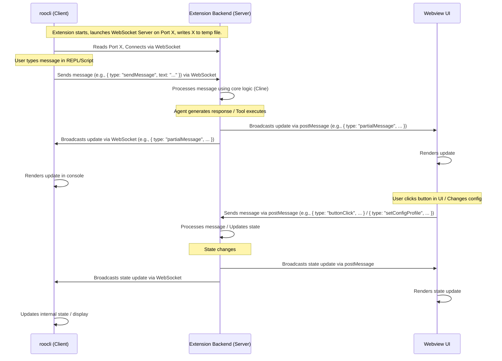

# Roo Code CLI (`roocli`) Architecture Plan

## 1. Goal

To create a standalone Command Line Interface (CLI) named `roocli` for Roo Code. This CLI should:

- Interface with the existing Roo Code VS Code extension backend.
- Mirror the functionality and interaction style of the extension's webview UI.
- Maintain real-time state synchronization between the CLI and the webview UI.
- Support both an interactive REPL chat mode (similar to `aider`) and a non-interactive scripting mode.

## 2. Core Challenge

Establishing a robust and synchronized communication channel between the external `roocli` process and the Roo Code extension backend running within VS Code.

## 3. Communication Protocol: WebSocket IPC

A WebSocket-based Inter-Process Communication (IPC) channel will be used.

- **Extension Backend (Server):** The Roo Code extension backend will host a lightweight WebSocket server on a local port upon activation.
- **CLI (Client):** The `roocli` process will act as a WebSocket client, connecting to the server hosted by the extension.
- **Message Flow & Synchronization:**
    - The extension backend remains the single source of truth for state (active task, conversation history, configuration profile, mode, etc.).
    - Messages/commands initiated from either the CLI (via WebSocket) or the Webview UI (via `postMessage`) are sent to the backend.
    - The backend processes the message/command.
    - The backend **broadcasts** all resulting updates (AI responses, tool outputs, state changes) to **all** connected clients:
        - To the Webview UI via `postMessageToWebview`.
        - To all connected `roocli` instances via the WebSocket server.
    - This ensures both the CLI and Webview UI always reflect the same synchronized state.
- **Configuration Management:** This architecture inherently supports changing configuration profiles (provider credentials, settings) and modes mid-session. Changes initiated from any interface are processed by the backend and broadcast to all interfaces.

## 4. Port Discovery

To enable the CLI to find the extension's WebSocket server:

1.  The extension backend, upon starting the WebSocket server, will write the allocated port number to a temporary file in a predictable location (e.g., within the extension's global storage directory).
2.  The `roocli` will read this file at startup to determine the correct port for connection.

## 5. Proposed `roocli` Directory Structure

```
roocli/
├── src/
│   ├── cli.ts             # Main entry point, command parsing (e.g., yargs/commander)
│   ├── ipcClient.ts       # Handles WebSocket connection and message sending/receiving
│   ├── repl.ts            # Implements the interactive REPL chat mode
│   ├── scripting.ts       # Handles non-interactive command execution
│   ├── display.ts         # Utilities for formatting and printing output to the console
│   └── utils/
│       └── config.ts      # Reads config, finds WebSocket port file location
├── package.json
├── tsconfig.json
└── README.md
```

## 6. Communication Flow Diagram (Mermaid)



## 7. High-Level Implementation Steps

1.  **Setup:** Create the `roocli` directory and initialize the Node.js project (`package.json`, `tsconfig.json`).
2.  **Extension Modification (Minor):**
    - Integrate a WebSocket server library (e.g., `ws`) into the extension backend (`src/`).
    - Implement the WebSocket server logic (start server, handle connections, receive messages).
    - Implement the port discovery file writing mechanism.
    - Modify existing message broadcasting points (where `postMessageToWebview` is called) to also iterate over active WebSocket connections and send the same message.
    - Add logic to route messages received via WebSocket into the existing message handling flow (e.g., `webviewMessageHandler`).
3.  **CLI Implementation (`roocli`):**
    - Implement the `ipcClient.ts` to handle WebSocket connection logic (reading port file, connecting, sending/receiving messages, handling disconnection/reconnection).
    - Set up command-line argument parsing (`cli.ts`) using a library like `yargs` or `commander` to handle different modes (chat vs. script) and options.
    - Develop the interactive REPL mode (`repl.ts`) using libraries like `readline` for user input and `ipcClient` for communication.
    - Develop the scripting mode (`scripting.ts`) to take a message via arguments, send it via `ipcClient`, wait for completion/output, and exit.
    - Create display utilities (`display.ts`) for rendering messages, progress indicators, etc., in the console appropriately.
